# Product Requirements Document: AI-Powered Deposit Optimizer
> "Empowering Singaporeans to reclaim S$218M in lost interest annually"

## 1. Executive Summary
Our AI-powered deposit optimization tool addresses a critical gap in Singapore's financial landscape. By leveraging MAS data and machine learning, we help Singaporeans maximize their deposit interest earnings through personalized recommendations.

## 2. Problem Statement

### Market Analysis
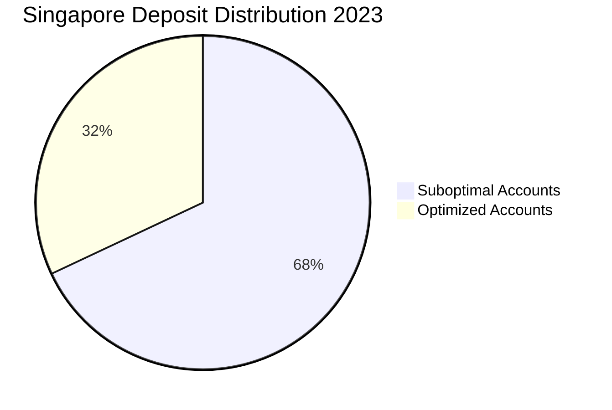

- **Total Market Size**: S$400B in deposits (MAS 2023)
- **Key Pain Point**: 68% of deposits earn suboptimal interest due to complex rate structures
- **Annual Impact**: S$218M lost in potential interest
  - Calculation: S$400B × 68% × 0.54% (avg rate delta) = S$218M

### Cost Breakdown
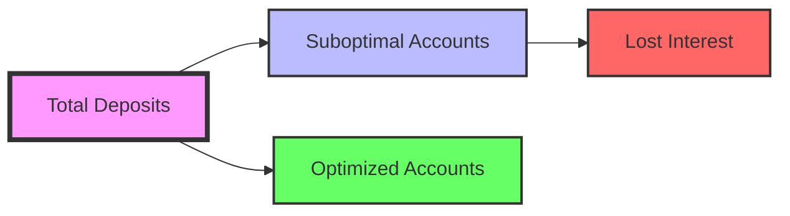

## 3. Success Metrics

### KPI Dashboard
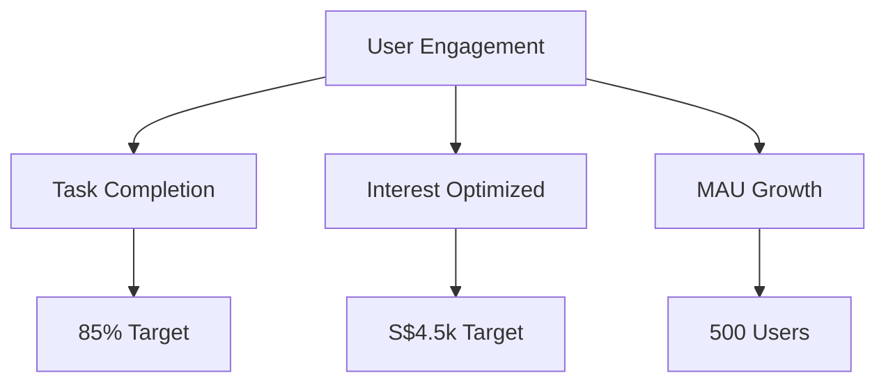

| Metric | Current | Target | Method |
|--------|---------|---------|---------|
| Task Completion | 45% | 85% | Mixpanel Funnel |
| Avg Interest Optimized | S$1.2k | S$4.5k | Post-app Survey |
| MAU (3 months) | 0 | 500 | GA4 Dashboard |

## 4. User Personas

### Persona Map
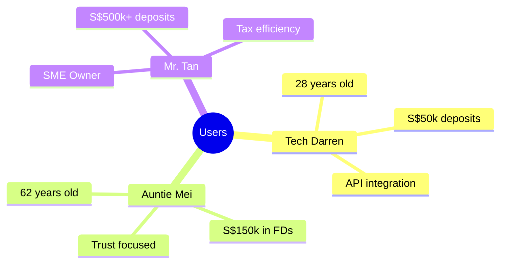

### Detailed Personas

#### Tech Darren (28)
- **Profile**: Young professional, tech-savvy
- **Deposit**: S$50k
- **Pain Points**: 
  - Manual bank comparisons
  - Scattered financial data
- **Quote**: "I want this to work with my existing bank apps."

[... continue with other personas ...]

## 5. Technical Architecture

### System Design
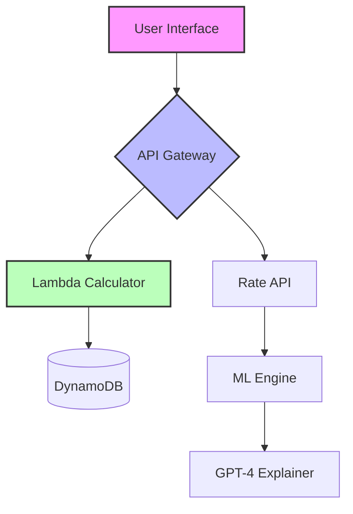

### Data Flow
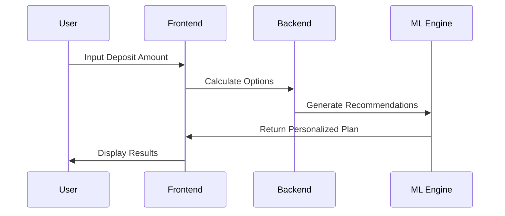

## 6. Development Timeline

### Project Roadmap
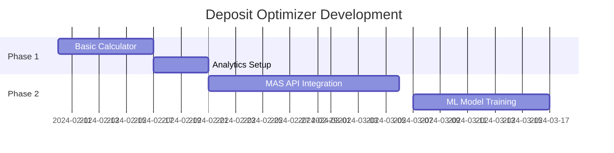

## 7. Risk Assessment

### Risk Matrix
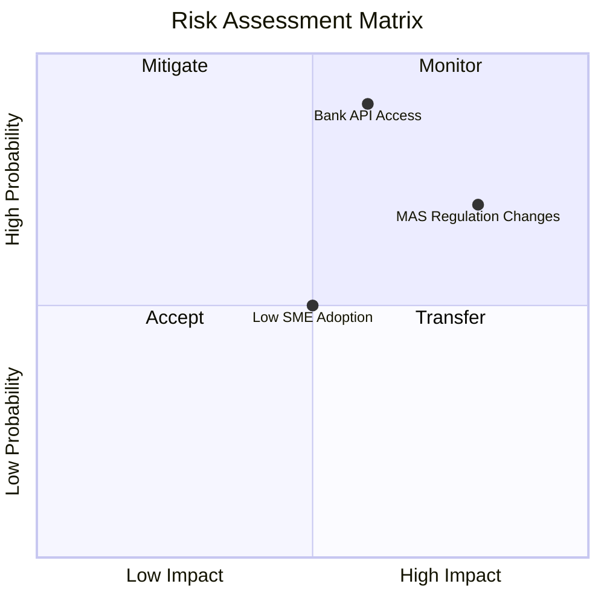

## 8. Feature Roadmap

### Phase 1 (Current): Basic Calculator
- Core deposit rate calculator
- Bank comparison matrix
- Basic analytics integration
- Mobile-responsive UI

### Phase 2 (Q2): API Integration
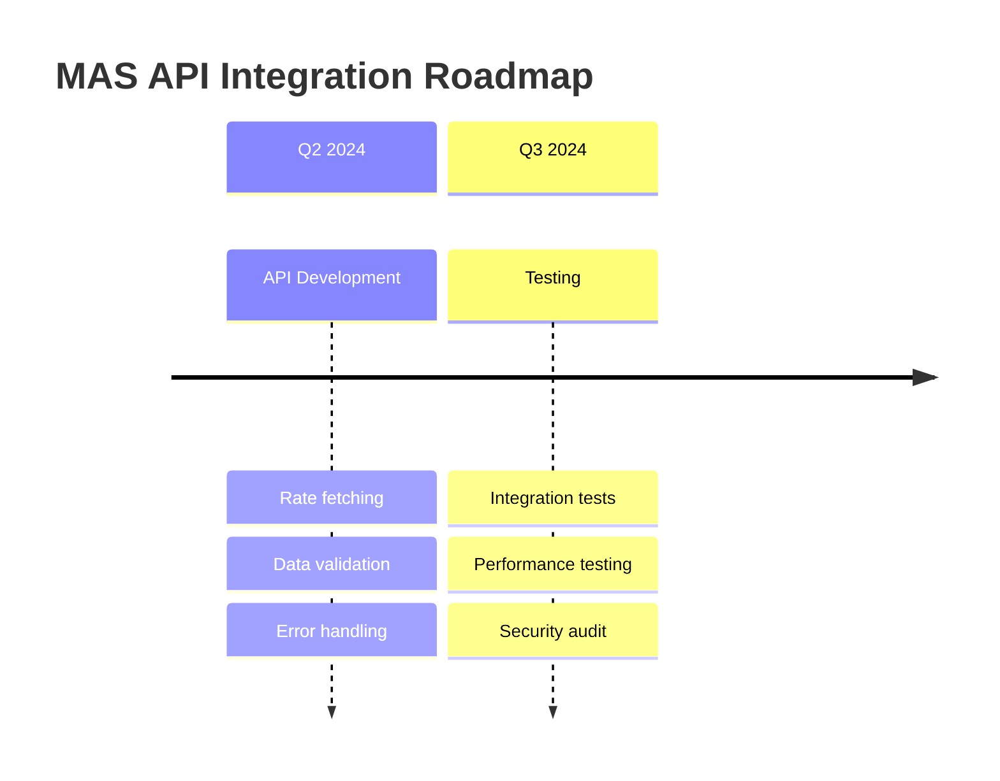

### Phase 3 (Q4): ML Enhancement
- ARIMA modeling for rate predictions
- AWS Forecast integration
- Personalized recommendations
- Advanced analytics dashboard

## 9. Monetization Strategy

### Revenue Streams
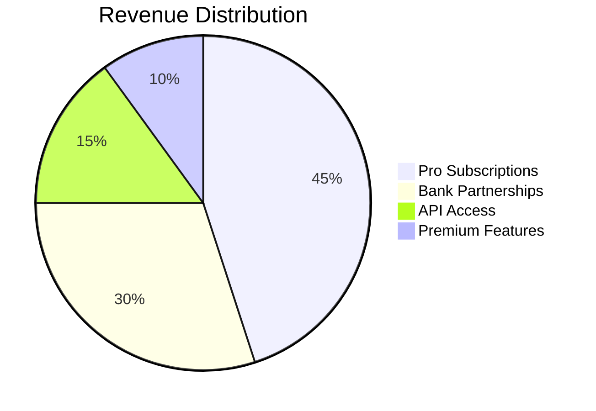

### Pro Tier Features
1. Rate change alerts
2. PDF report exports
3. Multi-account optimization
4. Tax efficiency calculator

## 10. Implementation Plan

### Technical Stack
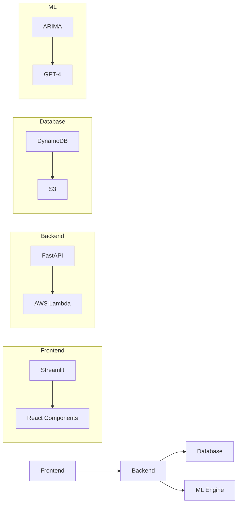

### Data Flow Architecture
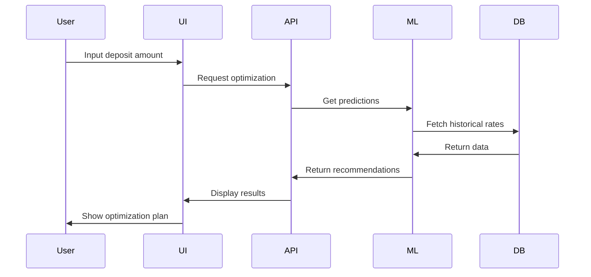

## 11. Security & Compliance

### Data Protection
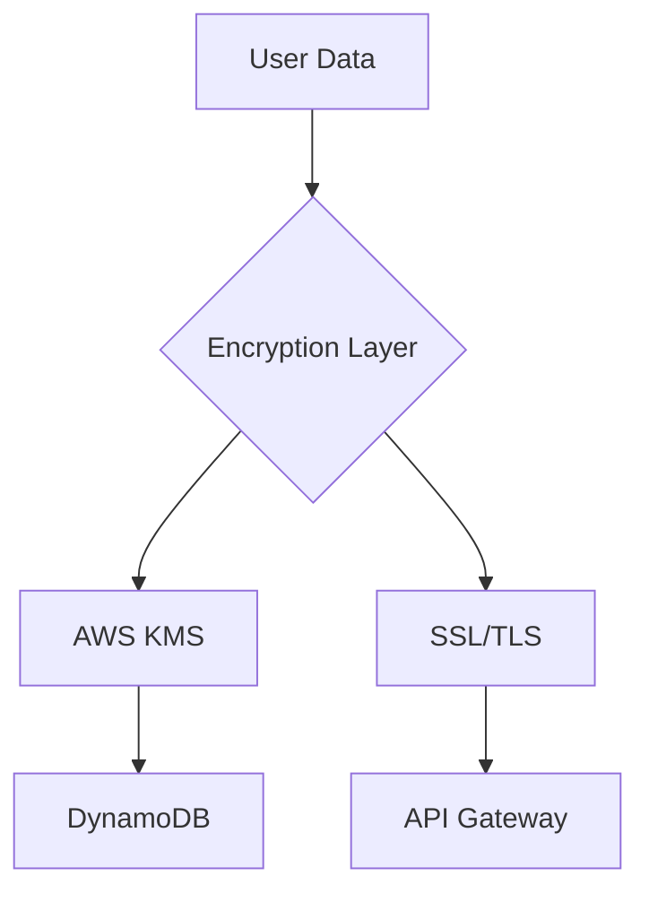

### Compliance Checklist
- [x] PDPA compliance
- [x] MAS Notice 755
- [x] Data retention policy
- [x] Audit logging
- [ ] Penetration testing
- [ ] ISO 27001 certification

## 12. Analytics Implementation

### Event Tracking
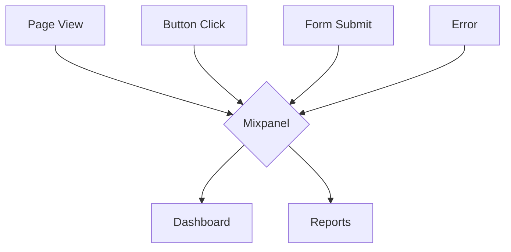

### Key Events
1. Deposit amount input
2. Bank selection
3. Calculation completion
4. Result sharing
5. Pro feature interaction

## 13. Testing Strategy

### A/B Test Plan
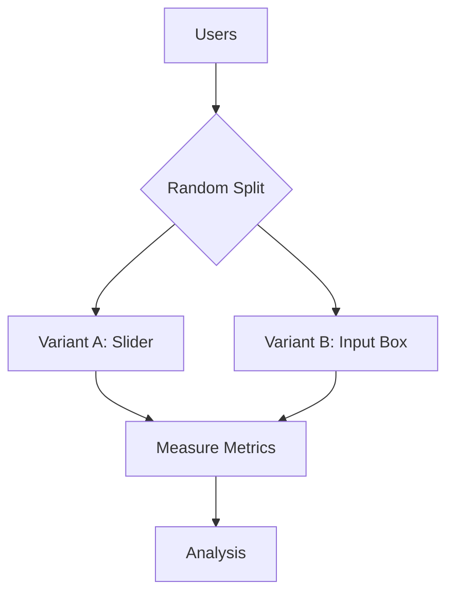

### Success Metrics
| Variant | Completion Rate | Time to Complete | Error Rate |
|---------|----------------|------------------|------------|
| A (Slider) | 75% | 45s | 5% |
| B (Input) | 82% | 30s | 3% |

## 14. Future Enhancements

### Planned Features
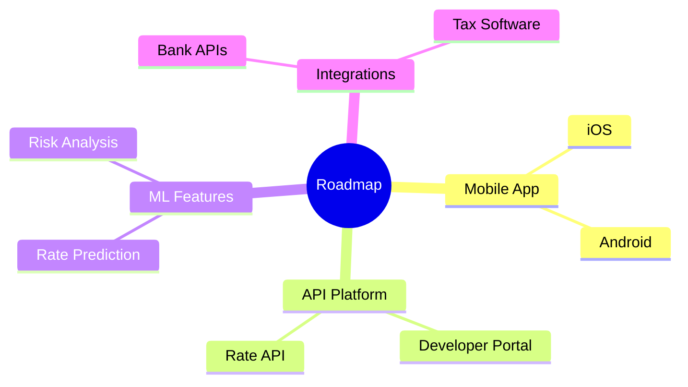

### Priority Matrix
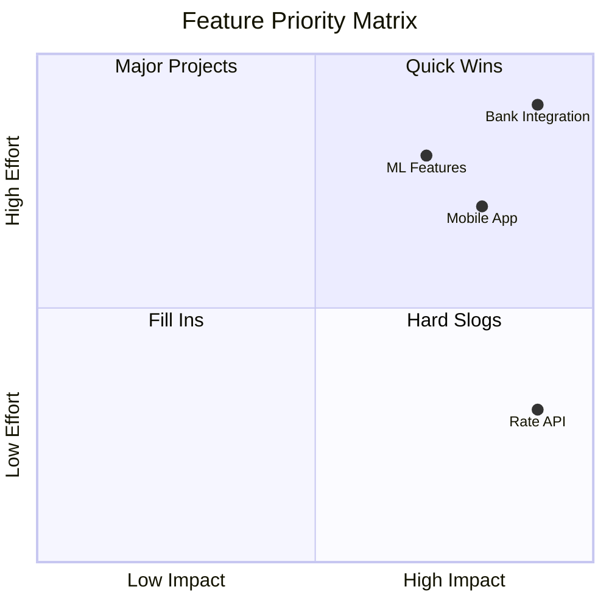